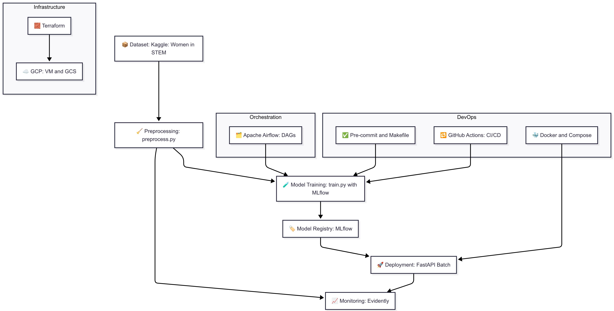

# Women in STEM – MLOps Project

This project demonstrates an end-to-end **MLOps pipeline** using real-world educational data to predict female graduation rates in STEM fields across 6 countries (2000–2023). It showcases production-grade practices including **data engineering**, **training and deployment**, **monitoring**, **containerization**, **orchestration**, and **CI/CD**.

---

## 🔧 Tech Stack

* **Language**: Python 3.10
* **Infrastructure**: Terraform + GCP Free Tier (VM, GCS)
* **Orchestration**: Apache Airflow
* **Experiment Tracking**: MLflow
* **Monitoring**: Evidently
* **API Deployment**: FastAPI + Uvicorn
* **Containerization**: Docker + Docker Compose
* **CI/CD**: GitHub Actions
* **Testing**: pytest + pre-commit hooks

---

## 🧠 Project Structure

```
women-in-stem-mlops-project/
├── README.md
├── Makefile
├── requirements.txt
├── .gitignore
├── .pre-commit-config.yaml
├── Dockerfile
├── docker-compose.yml
├── pyproject.toml
│
├── infra/                         # Terraform infrastructure code
│   ├── main.tf
│   ├── variables.tf
│   ├── terraform.tfvars
│   ├── outputs.tf
│   └── startup-script.sh
│
├── mlruns/                        # MLflow experiment logs
│
├── data/
│   ├── raw/                       # raw input dataset (CSV)
│   └── processed/                 # cleaned and transformed data
│
├── notebooks/
│   └── 01_eda.ipynb               # exploratory data analysis
│
├── src/                           # core logic
│   ├── train.py
│   ├── evaluate.py
│   └── preprocess.py
│
├── fastapi_app/
│   └── main.py                    # FastAPI app for batch inference
│
├── airflow/
│   └── dags/
│       └── stem_pipeline_dag.py   # DAG for end-to-end orchestration
│
├── monitoring/
│   ├── generate_report.py         # Evidently drift report
│   └── reports/
│
├── tests/                         # unit tests
│
└── .github/
    └── workflows/
        └── ci.yml                 # GitHub Actions pipeline
```

---
## 🗺️ Architecture Overview



---
## 📊 Dataset Description

**Women in STEM: Global Education Trends Dataset (2000–2023)**

* Source: Kaggle (UNESCO, OECD, national statistics)
* Records: \~500 across 6 countries and 4 STEM fields
* Features:

  * `country`, `year`, `stem_field`
  * `female_enrollment`, `female_graduation_rate`
  * `gender_gap_index`

### 🔍 EDA Summary

* No missing or duplicate records.
* Low inter-feature correlation but strong year-over-year variability.
* Engineering showed highest avg. graduation (\~38%).
* Clear disparities across gender and regions.
* Processed data exported as `X.npy` and `y.npy`.

---

## ⚙️ Pipeline Overview

### 1. **Data Preprocessing**

* Normalizes features, encodes categoricals.
* Outputs NumPy arrays + serialized preprocessor.

### 2. **Model Training**

* Models: Random Forest, XGBoost, CatBoost
* Hyperparameters hardcoded for simplicity
* Tracked via MLflow

### 3. **Model Evaluation**

* Metrics: RMSE, MAE, R²
* Scores stored in MLflow + printed

### 4. **Deployment (FastAPI)**

* Batch endpoint: `POST /predict`
* Takes input JSON, returns graduation rate predictions

### 5. **Monitoring (Evidently)**

* Stability and drift checks: `generate_report.py`
* Outputs HTML reports to `/monitoring/reports/`

### 6. **Orchestration (Airflow)**

* `stem_pipeline_dag.py` runs: preprocess ➔ train all models ➔ evaluate

### 7. **CI/CD**

* GitHub Actions pipeline:

  * Lint with `ruff`
  * Run unit tests
  * Pre-commit checks

---

## 🚀 Run Locally (Assumed Dockerized)

```bash
# Build the image
sudo docker build -t women-in-stem-app .

# Run all services
sudo docker-compose up

# Access APIs/UI
- FastAPI: http://localhost:8000
- Airflow: http://localhost:8080
- MLflow: http://localhost:5000
```

---

## ✅ Tests

```bash
# Run all tests
pytest tests/

# Run pre-commit
pre-commit run --all-files
```

---

## 📈 Results

| Model        | RMSE  | MAE   | R²     |
| ------------ | ----- | ----- | ------ |
| RandomForest | 16.65 | 14.62 | -0.065 |
| XGBoost      | 18.22 | 15.52 | -0.276 |
| CatBoost     | 16.87 | 14.66 | -0.094 |

---

## 📎 References

* [Kaggle Dataset](https://www.kaggle.com/datasets/bismasajjad/womens-representation-in-global-stem-education)
* [MLflow Documentation](https://mlflow.org/)
* [Evidently Documentation](https://docs.evidentlyai.com)
* [Airflow Docs](https://airflow.apache.org/docs/)

---

## 👤 Author

**Konstantinos Soufleros**
Certified Machine Learning Engineer | MLOps Practitioner

---

## 🏁 Next Steps (Future Work)

* Enable online monitoring with Evidently Collector
* Add model registry and retraining logic
* Implement Slack alerting and cron-based Airflow triggers
* Optimize models with Optuna

---
